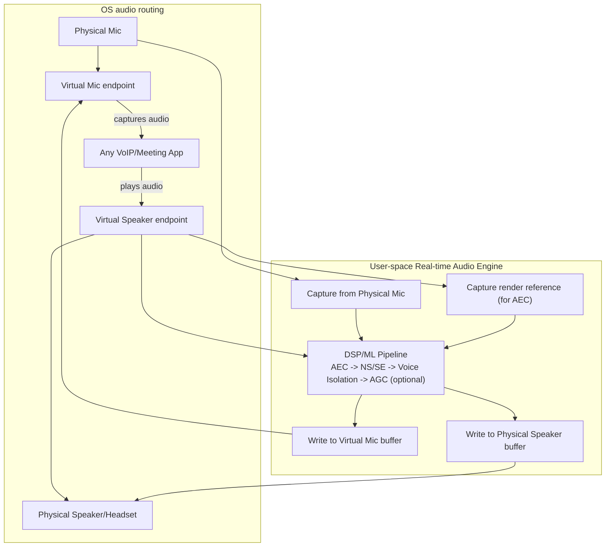
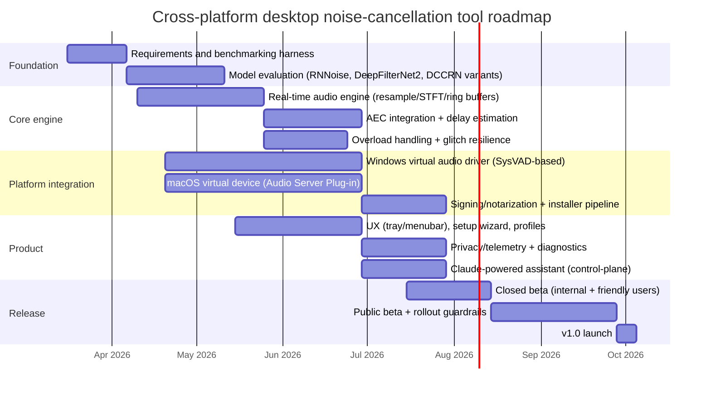

# Building a Cross-Platform Real-Time Noise Cancellation Desktop Tool

## Executive summary

This report analyses Krisp.ai as a reference product and synthesises an actionable, engineering-focused blueprint for building a comparable **cross-platform (macOS + Windows) real-time noise cancellation desktop tool** with an on-device ML/DSP pipeline, low latency, and virtual-device integration.

Krisp’s core product positioning is a **system-wide “audio layer”** that inserts itself between **physical audio devices** and **communication apps**, exposing **virtual devices** (e.g., “Krisp Microphone” and “Krisp Speaker”) so video-conferencing/VoIP apps can route audio through Krisp’s processing. Krisp publicly describes this bidirectional routing model (outbound mic cleaning and inbound speaker cleaning). citeturn21search1

Publicly disclosed technical details strongly suggest:
- **On-device inference** is the default design (privacy and latency). Krisp describes a deep neural network trained on “10K+ hours” and emphasises that the desktop app acts as a virtual microphone. citeturn12view0turn21search1  
- Algorithmic latency is plausibly **~15 ms** for at least one of Krisp’s real-time “voice isolation” model lines (16 kHz internal bandwidth). citeturn5search0  
- Their published patent shows a **time–frequency masking architecture**: audio is framed/overlapped, transformed to Fourier coefficients, features such as **log magnitude** are fed to a neural network that outputs a **ratio mask**, with a noise model updated online over past frames. citeturn1search1  
- Their SDK documentation (browser SDK, but instructive) explicitly lists **supported sample rates**, recommends avoiding resampling where possible, and describes **buffer-overflow handling** for overload events—valuable cues for robust real-time design. citeturn11search0  

The recommended architecture for a new competitor product is:
- **Kernel / driver layer** (especially on Windows) to expose stable virtual capture/render endpoints (virtual mic and virtual speaker).
- **User-space real-time audio engine** (C++/Rust) to perform capture → resample → AEC/NS/voice isolation → render, with strict frame scheduling and glitch resilience.
- **On-device inference runtime** (e.g., ONNX Runtime with CPU + platform accelerators where appropriate) plus optional, controlled GPU/NPU acceleration.
- A **control-plane assistant** using entity["company","Anthropic","ai safety company"] Claude for orchestration/UX (settings help, troubleshooting, profile recommendations, policy enforcement, telemetry summarisation)—but **not** for real-time audio inference.

Assumptions (explicit):
- Latency target **“<20 ms if possible”** is treated as an aspirational goal for the *noise suppression path* under typical conditions; the end-to-end perceptual round-trip latency will also include OS buffering, conferencing app buffering, and device latency.
- The tool is **on-device by default** (no cloud audio streaming), consistent with Krisp’s public on-device positioning and modern privacy expectations. citeturn12view0turn5search17  

## Krisp.ai as the benchmark product

### Product behaviour and user-observable integration model

Krisp’s help centre describes that it creates an “additional layer” between the physical microphone/speaker and the communication app; inbound audio is processed by “Krisp Speaker” before reaching physical speakers, and outbound audio is processed by “Krisp Microphone” before reaching the app. citeturn21search1

Krisp’s engineering blog further states that the desktop app (Windows and Mac) “acts as a virtual microphone device,” and that its noise cancellation is based on a deep neural network trained on “10K+ hours of human voice and background noises.” citeturn12view0

This is the archetypal approach for “works with everything” desktop noise cancellation:
- Expose a **virtual capture device** for outbound (mic) cleaning.
- Expose a **virtual render device** for inbound (speaker) cleaning—or process app audio in another way, depending on OS constraints and UX tradeoffs.
- Provide a tray/menubar UI to select the *real* physical mic/speaker that the virtual devices connect to.

Krisp also documents practical constraints you should expect to replicate/handle:
- **Virtual device conflicts:** Krisp warns that using one virtual audio device with another can cause conflicts (double processing, feedback, artefacts). citeturn21search10  
- **System-default device policy tension:** Krisp notes (for Windows guidance) that setting the virtual speaker as system default is problematic because system sounds may be treated as noise; in contrast, setting the virtual microphone as default is supported. citeturn21search9turn21search5  

### Public performance and deployment signals

Krisp’s published “system requirements” (as of the referenced help article) are informative as an implicit performance envelope: macOS 14+ and Windows 10/11 64-bit, with recommended CPU class around entity["company","Intel","semiconductor company"] Core i5 / Apple silicon, 8 GB RAM+. citeturn21search0  
This is consistent with **CPU-first inference** for real-time enhancement, and Krisp’s SDK pages explicitly state “Krisp SDKs run on CPU.” citeturn21search4

Krisp also advertises performance modes (Auto / Best NC / CPU Optimized), signalling that real-time compute budget management is a first-class product concern. citeturn21search30turn11search1

### Echo/room processing features

Krisp states that “Room Echo Cancellation” is enabled by default and cannot be disabled, and it ties the feature’s effectiveness to selecting Krisp Microphone and enabling noise cancellation. citeturn5search1  
It also publicly claims to support acoustic echo cancellation in general explainer content. citeturn5search10

For a competitor, this implies:
- AEC / echo handling is expected at the product level, not merely “noise suppression.”
- UX will need guardrails: AEC needs a reliable “far-end reference” stream (speaker output) and correct delay estimation, or it can degrade audio.

### Architectural hints from Krisp’s patent + engineering blog

Krisp’s patent (Google Patents snip) describes a pipeline that:
- Splits audio into overlapping frames, computes Fourier coefficients,
- Uses features like **log magnitude**,
- Inputs these into a neural network that outputs a **ratio mask** (applied to a noisy spectrogram),
- Maintains a “noise model” updated over prior frames. citeturn1search1  

Separately, Krisp’s Chrome-extension engineering blog reveals:
- Their DNN “operates on 30 ms frames,”
- Chrome provided “3 ms frames” and required sub-3 ms processing per callback,
- They buffered to 30 ms then restructured computation to avoid dropouts under CPU contention (including splitting inference work across smaller slices). citeturn12view0  

This directly informs a robust desktop design: real-time audio pipelines frequently face **hard scheduling constraints** and **bursty CPU load** (video calls, screen sharing, multitasking). Engineering must plan for overload behaviour, not just “average” runtime.

## Likely signal-processing and ML architecture for a Krisp-class tool

### Reference processing graph for real-time communications

A conventional real-time communications enhancement stack typically has *at least*:
- **High-pass / DC removal** (optional)
- **AEC** (if full-duplex speaker + mic and echo is expected)
- **Noise suppression / speech enhancement (NS/SE)**
- **VAD** (voice activity detection) to stabilise noise estimation / gating and to drive UX features like “talk time”
- Optional: **dereverberation**, **beamforming** (multi-mic), **background voice cancellation / voice isolation**

The open-source WebRTC Audio Processing Module (APM) is a useful reference architecture:
- It processes audio **frame-by-frame**, with a clear near-end stream (“ProcessStream”) and reverse/far-end stream (“AnalyzeReverseStream”) used as echo reference. citeturn8search6turn15search24  
- It explicitly expects **10 ms frames** (common in VoIP). citeturn8search4turn8search6  
- It exposes modules like echo cancellation, noise suppression, gain control, and voice detection as typical RTC building blocks. citeturn8search25turn15search24  

This 10 ms framing is also a practical benchmark: if your product targets <20 ms algorithmic latency, you are effectively constrained to **0–1 frames of lookahead** (plus STFT overlap if used).

### Model families and real-time implications

Below is a rigorously grounded comparison of model families commonly used for real-time speech enhancement / noise cancellation, with implications for latency, compute, and integration.

#### Hybrid DSP + small recurrent models (RNNoise-style)

The canonical example is RNNoise (Jean‑Marc Valin; entity["organization","Xiph.Org Foundation","open-source multimedia org"] ecosystem):
- The paper describes a **hybrid DSP/deep learning** approach using **20 ms windows with 50% overlap (10 ms hop)**, a recurrent model predicting **critical-band gains** (22 Bark-like bands), plus a pitch filter for harmonic structure. citeturn14view0  
- The approach explicitly aims for **real-time operation at 48 kHz on a low-power CPU**. citeturn14view0  
- The RNNoise repository describes it as a noise suppression library based on an RNN, provides training instructions, and ships under **BSD-3-Clause** licensing. citeturn13view0  

Why it matters:
- RNNoise-style systems are often strong “baseline” candidates for **low CPU**, **small memory footprint**, and **easy deployment**, especially when you can accept a classic masking/gain-control style output.
- They typically work best when you can tolerate some artefacts and when “voice naturalness” requirements are moderate.

#### Complex STFT masking / CRN / DCCRN families

DCCRN (Deep Complex Convolution Recurrent Network) is a well-cited architecture:
- It models complex spectra with complex-valued operations and recurrent context.
- The arXiv record states that a DCCRN variant with ~3.7M parameters ranked highly in a real-time DNS challenge track. citeturn6search6  

Why it matters:
- These models can deliver strong enhancement quality and phase-aware improvements, but they often carry higher compute cost; careful optimisation (quantisation, pruning) is usually required for desktop-wide deployment.

#### DeepFilterNet family (efficient full-band real-time speech enhancement)

DeepFilterNet / DeepFilterNet2 are particularly relevant because they are explicitly designed for **full-band (48 kHz) real-time**:
- DeepFilterNet’s Interspeech demo paper reports matching strong benchmarks while achieving a reported **real-time factor** around 0.19 on a single-thread notebook (as presented in the paper). citeturn6search33  
- DeepFilterNet2 targets embedded/full-band constraints and reports reducing the real-time factor to **~0.04 on a notebook Core‑i5 CPU**, supporting 48 kHz full-band audio. citeturn7search0  
- The DeepFilterNet project is **dual-licensed Apache-2.0 or MIT**, is designed to support Linux/macOS/Windows, and includes a real-time plugin pathway (LADSPA/PipeWire context) plus delay-compensation flags to account for STFT + lookahead. citeturn22view0  

Why it matters:
- For a Krisp-class desktop tool (which must handle 48 kHz devices smoothly), DeepFilterNet2-like design constraints align closely with your requirements.
- It provides a strong “open-source starting point” option when licensing and downstream product differentiation are acceptable.

### Latency constraints and what “<20 ms” realistically implies

Real-time denoising performance constraints from the broader research community provide a useful yardstick. The Deep Noise Suppression challenges specify requirements such as:
- Processing must complete within the frame stride time, and total algorithmic latency (frame + overlap/stride + lookahead) must be **≤40 ms** for the ICASSP DNS challenge. citeturn7search23  

This implies:
- A <20 ms target is aggressive but feasible for **noise suppression** if you constrain lookahead and keep the model efficient (more RNNoise/DeepFilterNet-like than Demucs-like).
- Some advanced transformations (e.g., accent conversion) can tolerate much larger latency; Krisp’s own Accent Conversion SDK page cites ~220 ms algorithmic latency for that feature, indicating that not all “voice AI” tasks are expected to be sub-40 ms. citeturn5search4  

### Echo cancellation, dereverberation, beamforming: what is feasible on desktop

#### Acoustic Echo Cancellation (AEC)
AEC for desktop full-duplex requires a **far-end render reference** and robust delay alignment. The WebRTC APM design formalises this with a reverse stream and 10 ms frame processing. citeturn8search6turn15search24

A pragmatic approach is to:
- Implement AEC as a first stage (when enabled) using a proven reference such as WebRTC AEC3-style architecture (or equivalent), and treat it as its own performance-critical path.

#### Dereverberation
Dereverberation is harder than denoising. Classic methods like WPE (Weighted Prediction Error) operate in the STFT domain and use multi-channel linear prediction; the referenced work (University of Oldenburg) describes WPE-based speech dereverberation with explicit modelling assumptions. citeturn15search14  
For a desktop tool:
- “Room echo cancellation” in product language may combine AEC + late-reverb suppression heuristics; you can implement a “light” dereverb mode with bounded compute and minimal extra latency.

#### Beamforming
Beamforming typically requires multiple microphone channels and known geometry. WebRTC includes a beamformer component interface, indicating a modular approach to multi-mic enhancement. citeturn15search0  
MVDR beamforming is a common technique; the TorchAudio tutorial outlines an MVDR approach using mask-based PSD estimation. citeturn15search1  
For consumer laptops:
- Beamforming is often already performed by hardware/OS audio stacks; your tool may receive only a mono, already-processed mic stream. Beamforming support becomes most useful for USB mic arrays that expose multiple channels.

### A plausible Krisp-class internal pipeline

Using Krisp’s patent description (ratio mask from neural network in a Fourier pipeline) and their public “real-time, on-device” framing, a reasonable inferred architecture is:

1) **Capture engine** (48 kHz possible)  
2) **Resampler** to internal model rate (commonly 16 kHz for speech-focused models), consistent with Krisp’s published 16 kHz model bandwidth claims in some Voice Isolation work citeturn5search0turn5search4  
3) **STFT feature extraction** (log magnitude, etc.)  
4) **Neural mask estimation** with online noise modelling citeturn1search1turn12view0  
5) **Mask application + reconstruction** (ISTFT / overlap-add)  
6) Optional “voice isolation” / background-voice cancellation stage for near-field headset cues (Krisp explicitly positions voice isolation as removing other human voices). citeturn5search3turn5search0  
7) **Output back to virtual device**

This is consistent with:
- Krisp’s published need to buffer to 30 ms frames internally in constrained environments. citeturn12view0  
- A ratio-mask spectral approach described in the patent. citeturn1search1  

### Performance tradeoff chart (qualitative, grounded in cited properties)

The following “compute vs latency flexibility” framing is based on the cited characteristics: RNNoise uses 20 ms windows/10 ms hop and is designed for low-power CPU; DeepFilterNet2 targets embedded real-time with extremely low real-time factor; DCCRN is higher-parameter and often heavier; DNS challenge sets 40 ms algorithmic latency bounds for real-time tracks. citeturn14view0turn7search0turn6search6turn7search23  

```mermaid
flowchart LR
A[Very low compute<br/>(RNNoise-style)] --> B[Low compute<br/>(DeepFilterNet2-style)]
B --> C[Medium compute<br/>(CRN/DCCRN variants)]
C --> D[High compute<br/>(waveform-domain / large models)]
subgraph Latency
L1[~10-20ms feasible] --- L2[~20-40ms feasible] --- L3[>40ms typical]
end
```

## Platform integration and system-level engineering

### macOS integration: virtual audio devices, drivers, and background operation

On macOS, Apple’s modern direction is to keep drivers in user space (system extensions / DriverKit). Apple’s WWDC guidance explains the evolution:
- Pre–macOS Big Sur, audio server plug-ins often relied on kernel extensions for device communication.
- With Big Sur and newer, DriverKit moved this out of kernel; macOS Monterey introduced AudioDriverKit so hardware drivers can be implemented as a driver extension without a separate audio server plug-in. citeturn17view3  
- Critically, Apple explicitly notes that **if a virtual audio driver/device is all that is needed, the audio server plug-in driver model should continue to be used**. citeturn17view3  

Implications for your product:
- A Krisp-style “virtual mic / virtual speaker” is best implemented as a **CoreAudio Audio Server Plug-in** (virtual device) rather than AudioDriverKit (which is oriented to hardware device families and entitlements). citeturn17view3  
- You will still ship a user-facing app (menubar/tray) to control routing, but the virtual device must be stable even if UI restarts.

Distribution/security requirements:
- Apple requires system extensions to be distributed via App Store or notarised for outside distribution. citeturn4search1  
- Notarisation requires Developer ID certificates for app/installer and is part of modern Gatekeeper expectations. citeturn4search4  
- System extensions installation requires explicit activation requests and administrator approval, per Apple’s WWDC session on system extensions. citeturn4search10  

Background service model:
- Apple’s ServiceManagement framework (SMAppService) supports registering login items, launch agents, and launch daemons to keep helper executables running and visible in “Login Items / Allow in the Background.” citeturn19search0turn19search4  

Permissions:
- On macOS 10.14+ users must explicitly grant mic access per-app; apps must declare NSMicrophoneUsageDescription as the purpose string. citeturn20search1turn20search0  

### Windows integration: virtual audio endpoints, audio APIs, and driver signing

A Krisp-style Windows integration typically relies on a virtual audio driver that exposes:
- A **virtual capture endpoint** (“microphone”)
- A **virtual render endpoint** (“speaker”)

On Windows, kernel-mode driver work is usually required to present stable system-wide audio endpoints; Microsoft’s WDK includes sample drivers:
- Microsoft’s “SysVAD” (Virtual Audio Device Driver) is documented as a starting point for a universal audio driver. citeturn3search28turn3search31  

Audio API reality:
- Modern Windows audio development is built around WASAPI/core audio; Microsoft explicitly labels Waveform Audio (MME waveIn/waveOut) as legacy and recommends WASAPI/Audio Graphs for new code. citeturn18search4  
- Legacy APIs still exist and sit atop the modern audio architecture, but you should target WASAPI for predictable latency and device control. citeturn18search16  

Audio effects alternative (APO):
- Windows has Audio Processing Objects (APOs) shipped with an audio driver; Windows 11 introduces APIs for APOs as a hardware/OEM path. citeturn19search20  
For a third-party “virtual device” product, APO-based integration is typically harder to distribute broadly than a virtual endpoint driver, but it is an option for OEM/channel partnerships.

Security and signing:
- Microsoft’s driver signing policy requires kernel-mode drivers to be signed; for Windows 10 (1607+) new kernel drivers must be signed via Microsoft’s portal, and an **EV code signing certificate** is required to establish a hardware-dev dashboard account. citeturn4search2turn4search6  
- Microsoft documents attestation signing prerequisites (EV cert + hardware dev program registration). citeturn4search24turn4search25  

Permissions:
- Microphone access can be blocked by Windows privacy settings; Microsoft documents how users enable microphone permission globally and for apps (including desktop apps). citeturn19search3  

### Practical driver vs user-space boundary

A robust architecture separates:
- **Driver / virtual device layer**: create endpoints, buffer audio, expose ring buffers / interfaces.
- **User-space audio service**: ML/DSP processing, device switching, UI control, telemetry.

This separation is aligned with:
- Apple’s emphasis on user-space driver models for security/stability and the virtual-device recommendation for Audio Server Plug-ins. citeturn17view3turn4search10  
- Windows’ reality that audio endpoints are a device/driver concept while policy/UI/ML belongs in user space. citeturn3search28turn4search2  

## Proposed product architecture and PRD

### Product concept

A system-wide, on-device “voice clarity layer” for calls that provides:
- **Virtual Mic**: removes background noise and optionally background voices from your outgoing mic stream.
- **Virtual Speaker**: removes noise from incoming remote participants (optional; can be disabled or limited to “voice-only” apps to avoid corrupting system sounds).
- **AEC / Room echo cancellation**: reduces echo in speakerphone scenarios.
- **Profiles & automation**: per-app profiles, automatic device switching, and “CPU Saver / Balanced / Max Quality” modes similar in intent to Krisp’s performance modes. citeturn21search30turn11search1  

### High-level architecture



### Processing pipeline data flow and scheduling

```mermaid
flowchart LR
A[Audio callback / frame pull] --> B[Frame normalisation\n(int16 <-> float)]
B --> C[Resample to model rate\n(eg 16k/32k)] --> D[STFT + features]
D --> E[Neural inference\n(mask / filter estimation)]
E --> F[Apply mask/filter + ISTFT]
F --> G[Post-processing\n(limiters, de-click, comfort noise optional)]
G --> H[Write to output ring buffer]
```

Design constraints grounded in the ecosystem:
- 10 ms frames are a common and well-supported real-time boundary (e.g., WebRTC APM’s contract). citeturn8search4turn8search6  
- Resampling is a recurring source of overhead/latency; Krisp’s SDK explicitly recommends using the microphone’s default sample rate to avoid intermediate resampling and mentions resampling restarts as a source of extra latency. citeturn11search0turn11search1  
- Overload handling is essential: Krisp’s SDK documents buffer overflow handling and buffer drop thresholds, which suggests real products need explicit policies for “CPU contention” scenarios. citeturn11search0turn12view0  

### Performance targets

Targets should be expressed as **SLOs with device tiers**, not single-point promises.

Recommended targets (initial PRD):
- **Algorithmic latency (NS-only path)**: target 10–20 ms for “Balanced”; allow 20–40 ms for “Max Quality” (aligns with DNS real-time track constraints). citeturn7search23turn8search4  
- **End-to-end added latency** (user-perceived): target “not noticeable in calls” under typical conferencing buffers; measure with loopback tests.
- **CPU usage** (baseline tier): on a system meeting Krisp-like recommended specs (Core i5-class CPU, 8 GB RAM), aim for single-digit % CPU for NS-only, and bounded CPU for AEC+NS; provide “CPU Saver” mode. citeturn21search0turn21search30  
- **Sample rates supported**: 44.1/48 kHz physical I/O; internal model rate 16 kHz or 32 kHz depending on model class, consistent with Krisp’s published 16 kHz processing claims for some models and its SDK internal 16 kHz operation for certain features. citeturn5search0turn5search4turn11search0  

### Feature set and user flows

User flows should mirror what has proven workable for Krisp-like products:

- **Install & trust flow**
  - Windows: install signed driver + app; explain privacy settings if mic access fails. citeturn4search2turn19search3  
  - macOS: install app + virtual audio plug-in; request mic permissions and (if needed) background task approval via SMAppService. citeturn20search1turn19search4  

- **First-run setup**
  - Choose physical mic + physical speaker inside the app (auto-detect).
  - Show quick test: record/playback before/after.

- **Daily use**
  - In the call app, set input device = Virtual Mic; output device = Virtual Speaker (or keep output physical if you don’t support speaker processing). This is exactly the model Krisp documents. citeturn21search1turn21search17  

- **Auto device switching**
  - Detect headset plug/unplug; follow “remember my setup” behaviour similar to Krisp’s device management messaging. citeturn21search19  

- **Modes**
  - Balanced / Max Quality / CPU Saver, analogous to Krisp’s noise cancellation modes. citeturn21search30turn11search1  

### Security, privacy, and telemetry

Positioning: “audio never leaves device” by default, minimising regulatory scope and user trust risk.

Evidence that “on-device processing” is a recognised and marketable expectation:
- Krisp’s own engineering content positions real-time on-device DNN processing as the core of their solution. citeturn12view0  
- entity["company","Discord","chat platform company"]’s Krisp FAQ (for Discord’s integration) explicitly states the ML model runs on-device and no data is sent to Krisp’s servers in that integration context. citeturn5search17  

Telemetry recommendations (privacy-preserving):
- Collect only aggregate health metrics: CPU load, glitch counts, buffer overruns, selected mode, sample rate, model version.
- If you implement “call stats” (noise removed level, talk time), expose it locally and optionally upload only aggregated, non-audio metrics. Krisp’s SDK changelog describes per-frame “voice vs removed noise” stats and end-of-stream noise category summaries; you can implement similar without uploading raw audio. citeturn11search1  

### Comparison table: Krisp vs proposed product

| Capability | Krisp (publicly documented) | Proposed product (recommended baseline) |
|---|---|---|
| Virtual mic routing | Desktop app acts as a virtual mic; “Krisp Microphone” processes physical mic → app citeturn12view0turn21search1 | Yes (core design) |
| Virtual speaker / inbound cleaning | “Krisp Speaker” processes app audio → physical speaker citeturn21search1 | Optional; enable for voice apps, avoid default system output pitfalls (see system-sounds risk) |
| Background voice cancellation / voice isolation | Voice isolation keeps only main speaker; 16 kHz, ~15 ms algorithmic latency claim for a model citeturn5search3turn5search0 | Yes (tiered: “Noise only” vs “Noise + Voices”) |
| Echo/room echo cancellation | Room Echo Cancellation “by default,” cannot be turned off citeturn5search1 | Yes (AEC toggle + “speakerphone mode”) |
| Performance modes | Auto / Best NC / CPU Optimized citeturn21search30turn11search1 | Yes (similar modes with explicit SLOs) |
| Sample-rate handling | SDK lists many supported sample rates; recommends avoiding resampling; overload buffer policies citeturn11search0turn11search1 | Yes (resampler + stable internal rate + overload policy) |
| On-device processing positioning | DNN on-device described; performance constraints evident in Chrome case citeturn12view0turn5search17 | On-device by default; optional accelerators |
| Meeting assistant features (notes/transcription) | Part of Krisp’s broader AI Meeting Assistant offering citeturn21search23 | Out of scope for v1 (optional roadmap item) |

## Technology stack choices, Claude integration, roadmap, and risks

### Inference/runtime stack choices

A desktop tool needs predictable, low-jitter inference with flexible hardware backends.

Recommended default: ONNX Runtime as a cross-platform deployment layer, with adaptive execution providers:
- ONNX Runtime supports platform accelerators including **DirectML Execution Provider** on Windows. citeturn9search1turn9search3  
- It also supports **CoreML Execution Provider** on Apple platforms. citeturn9search0  
- For NVIDIA GPUs, ONNX Runtime integrates a **TensorRT Execution Provider**, and NVIDIA positions TensorRT as delivering low latency and high throughput inference. citeturn10search1turn10search0  

Model optimisation tools:
- Apple’s coremltools documentation describes post-training quantisation (e.g., 8-bit weight-only) as typically preserving accuracy well, with more aggressive 4-bit requiring careful granularity. citeturn9search2  

### Recommended open-source and commercial components

Open-source components (practical shortlist):
- RNNoise (BSD-3-Clause) as a lightweight baseline or fallback mode; includes published training and reverb augmentation guidance. citeturn13view0turn14view0  
- DeepFilterNet / DeepFilterNet2 (MIT/Apache-2.0 dual license) for full-band real-time enhancement; explicitly cross-platform in scope. citeturn22view0turn7search0  
- WebRTC APM concepts/components for echo cancellation/noise suppression structure and frame contracts; WebRTC source headers show BSD-style licensing norms. citeturn15search24turn8search18turn8search4  
- Microsoft DNS Challenge repo provides scripts/models and includes permissive licensing (code MIT; data CC-BY-4.0) suitable for research and benchmarking (subject to your legal review for commercial training). citeturn7search15  

Commercial / platform components:
- Driver signing (Windows): Microsoft attestation / WHQL path is not optional for broad distribution; EV certificate + portal signing are required. citeturn4search2turn4search24turn4search6  
- Apple distribution notarisation / system extension flows (where applicable). citeturn4search1turn4search4turn4search10  
- GPU inference: NVIDIA TensorRT (where available) for latency-critical inference; optional for consumer deployment. citeturn10search0turn10search1  

### Claude integration feasibility and recommended role

Claude excels as a **control-plane intelligence layer**, not a real-time DSP engine.

What Claude can reliably do in this product context:
- **Orchestrate tools and workflows**: Anthropic publishes “advanced tool use” patterns where Claude writes orchestration code to call tools and manage what data enters context, reducing repeated back-and-forth. citeturn23search2  
- **Provide streamed UI responses** (for settings/search/help) via streaming APIs in Claude docs. citeturn23search9  
- **Troubleshoot and guide**: interpret logs (buffer overruns, device changes), recommend switching to CPU Saver mode, suggest sample-rate changes, explain virtual-device conflicts, and generate user-friendly diagnostics reports.

Why Claude should *not* be in the real-time audio loop:
- Claude’s public API documentation is oriented to text/vision workflows and streaming text responses, not deterministic sub-10 ms inference inside an audio callback. citeturn23search9turn23search10  
- A public feature request exists for “audio input support in Messages API,” which implies native audio streaming into the Messages API is not a standard supported primitive for low-latency audio processing workloads. citeturn23search6  

Recommended combined architecture:
- **On-device ML/DSP** performs all real-time audio processing.
- Claude supports:
  - “Profile recommender” (choose model/mode based on device class, CPU headroom, meeting app).
  - “QA triage”: interpret per-frame stats similar to Krisp’s call stats concept and provide actionable fixes. citeturn11search1  
  - Policy management: enforce “no raw audio upload” and generate auditable privacy summaries.

### Milestones and timeline (indicative)



### Estimated resource needs (order-of-magnitude)

A credible v1 typically needs:
- Audio systems engineers (Windows driver + WASAPI pipeline; macOS CoreAudio virtual device).
- ML engineer(s) for model selection, optimisation (quantisation/pruning), evaluation harness.
- Product engineer(s) for UX, device switching, reliability, crash reporting.
- QA focused on audio edge cases: device hot-swap, exclusive mode conflicts, conferencing app quirks, CPU contention (mirroring Krisp’s Chrome constraints story). citeturn12view0turn11search0  
- DevOps/build & release engineer for signing/notarisation pipelines (high friction on Windows driver signing and macOS notarisation). citeturn4search2turn4search4turn4search10  

### Key risks and mitigations

Driver and OS integration risk:
- Windows kernel driver signing and distribution is complex and gated; mitigations include early attestation path planning and strict CI for driver stability. citeturn4search2turn4search24  
- macOS virtual audio implementation must track evolving Apple platform expectations; mitigations include aligning with Apple’s guidance that virtual devices remain in the audio server plug-in model and avoiding unsupported DriverKit entitlement paths for pure virtual devices. citeturn17view3  

Audio quality risk:
- Over-suppression and artefacts (musical noise, speech distortion). Mitigate with multiple modes and conservative defaults; DeepFilterNet provides an existence proof of full-band real-time enhancement with careful design. citeturn7search0turn22view0  
- Echo cancellation instability. Mitigate by strict delay estimation, optional AEC, and “headset detected” heuristics.

Performance risk:
- CPU contention in real calls (video conferencing) can cause dropouts; Krisp’s Chrome story demonstrates how strict callback time limits force architectural choices. Mitigate with ring buffers, workload slicing, and explicit overload policies (buffer drop / temporary disable). citeturn12view0turn11search0  

UX/compatibility risk:
- Virtual device conflicts (double processing) and app incompatibilities must be surfaced clearly; Krisp explicitly warns about virtual device conflicts and requires apps to support selecting virtual audio devices. citeturn21search10turn21search17  

Privacy/trust risk:
- Ensure microphone permission flows are correct on macOS, including usage strings and explicit authorisation patterns. citeturn20search0turn20search1  
- Ensure Windows microphone privacy settings guidance is embedded in troubleshooting. citeturn19search3  

